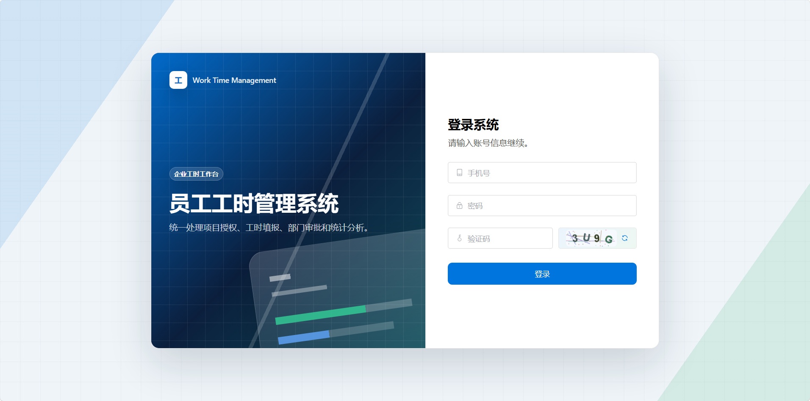
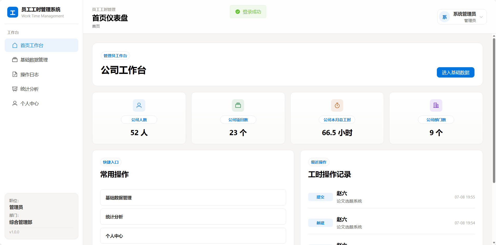
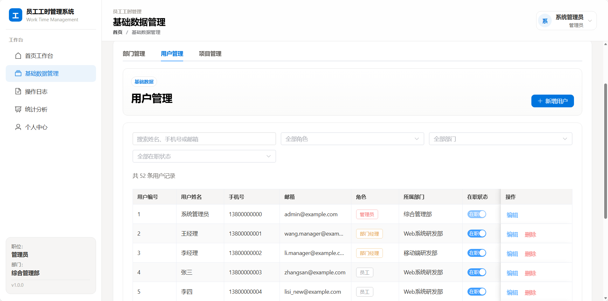
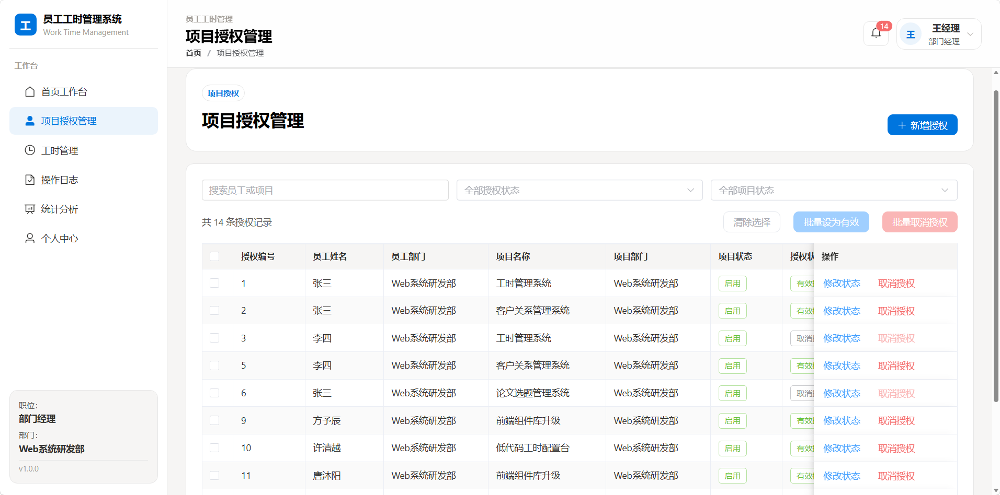
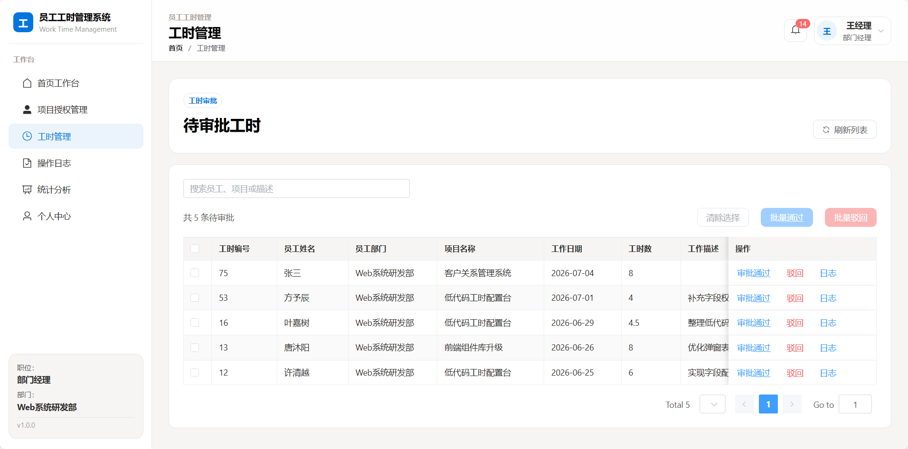
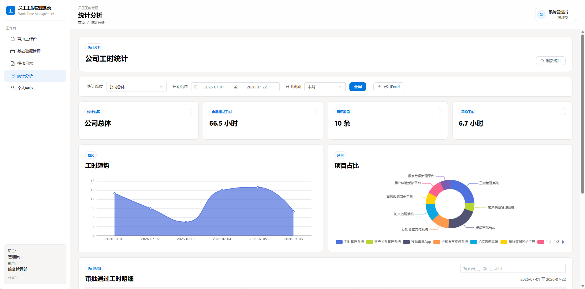
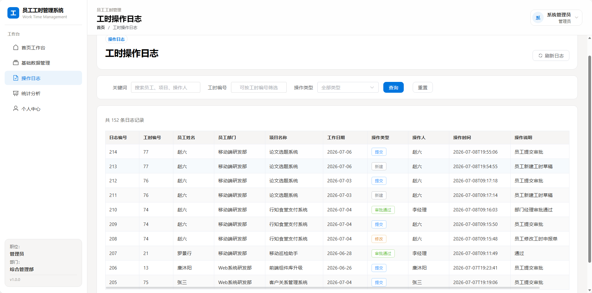

# 企业工时管理系统

> 一个面向企业内部的前后端分离工时管理系统，用于统一处理项目授权、员工工时填报、部门审批、统计分析和操作追溯。

本项目为个人独立开发的实践项目。系统围绕管理员、部门经理、员工三类角色设计，通过角色权限和部门数据范围控制，完成从基础数据维护到工时统计导出的完整业务闭环。

## 项目亮点

- **三角色数据权限**：管理员维护公司基础数据并查看公司统计；部门经理仅管理本部门员工的授权和审批；员工只能处理本人已授权项目的工时。
- **工时状态流转**：支持草稿、待审批、审批通过、已驳回四种状态；审批通过后的工时进入统计，驳回后可修改并重新提交。
- **业务一致性校验**：限制同一员工、同一项目、同一日期只能存在一条有效工时；项目禁用时自动取消相关有效授权，员工无法继续填报该项目。
- **操作可追溯**：工时的新建、修改、提交、审批通过、驳回等关键操作均记录在操作日志中。
- **多维统计与导出**：支持个人、部门、公司维度的工时统计；管理员和部门经理可按周、月、季度、年度导出 Excel 工时明细。
- **基础安全处理**：登录包含图形验证码；接口使用 HMAC-SHA256 签名 Token 校验身份；数据库密码和 Token 签名密钥通过环境变量配置。

## 技术栈

| 模块 | 技术 |
| --- | --- |
| 后端 | Java 17、Spring Boot、MyBatis、Maven、Jakarta Validation |
| 前端 | Vue 3、Vite、Vue Router、Pinia、Axios、Element Plus |
| 数据库 | MySQL 8.x |
| 测试与工具 | Apifox、Navicat、IntelliJ IDEA、Git、GitHub |

## 系统角色与功能

| 角色 | 功能范围 |
| --- | --- |
| 管理员 | 维护部门、用户、项目；重置用户密码；维护用户在职状态；查看公司、部门、个人维度统计；查看全部工时操作日志。 |
| 部门经理 | 查看本部门员工；为本部门员工授权项目；审批或驳回本部门员工工时；查看本部门统计和操作日志。 |
| 员工 | 填报、修改、删除、提交本人已授权项目的工时；查看个人统计和操作日志；维护个人资料。 |

## 核心业务规则

1. 员工只能填报本人拥有**有效授权**且项目状态为**启用**的项目。
2. 同一员工、同一项目、同一工作日期只能存在一条有效工时申报记录。
3. 工时按 `0.5` 小时粒度填写，范围为 `0.5` 到 `24` 小时，工作日期不能晚于当前日期。
4. 工时状态为：`0` 草稿、`1` 待审批、`2` 审批通过、`3` 已驳回；统计只计算审批通过且未删除的数据。
5. 部门经理只能审批本部门员工的待审批工时，驳回时必须填写原因。
6. 项目被禁用后，系统会将该项目下的有效授权同步改为取消授权。
7. 工时删除采用逻辑删除，历史工时和操作日志仍保留，便于后续追溯。
8. 系统只允许存在一名管理员；新增用户时仅可选择部门经理或员工角色。

## 功能模块

| 模块 | 功能说明 |
| --- | --- |
| 登录认证 | 手机号、密码、图形验证码登录；登录成功后保存 Token 并自动携带到后续请求。 |
| 基础数据管理 | 管理员维护部门、用户、项目；支持查询、新增、修改、删除、用户在职状态维护和管理员重置密码。 |
| 项目授权管理 | 部门经理为本部门员工授权项目，支持修改授权状态、取消授权与批量取消授权。 |
| 工时管理 | 员工新增、修改、删除、提交工时；经理查询待审批工时、批量审批、填写驳回原因，并查看缺卡或异常提醒。 |
| 统计分析 | 按个人、部门、公司维度查询审批通过工时，支持日期范围筛选和 Excel 明细导出。 |
| 操作日志 | 按权限范围查询工时操作日志，记录操作人、操作时间、操作类型和操作说明。 |
| 个人中心 | 查询和维护个人姓名、邮箱、登录密码等资料。 |

### 登录与工作台

<p align="center">
  
  
</p>

### 基础数据与项目授权

<p align="center">
  
  
</p>

### 工时管理与统计分析

<p align="center">
  
  
</p>

### 操作日志

<p align="center">
  
</p>

> 提示：请在添加图片后的同一次提交中再提交本 README，避免 GitHub 页面短暂显示图片缺失。

## 项目结构

```text
work-time-management/
├── backend/                 # Spring Boot 后端项目
│   ├── src/main/java/       # Controller、Service、Mapper、Entity、DTO、VO 等
│   └── src/main/resources/  # application.yml、MyBatis XML 映射文件
├── frontend/                # Vue 3 前端项目
│   └── src/                 # views、api、router、stores、styles、utils 等
├── database/                # MySQL 建表、初始化数据和迁移脚本
│   ├── schema.sql
│   ├── init-data.sql
│   └── migration/
├── test_doc/                # 接口文档、接口测试记录、功能测试用例
├── work_doc/                # 需求分析与数据库设计资料
├── docs/images/             # README 页面截图，按上文文件名自行添加
├── DESIGN.md                # 前端 UI 风格规范
└── README.md                # 项目说明文档
```

## 本地运行

### 1. 环境要求

- JDK 17 或更高版本
- MySQL 8.x
- Node.js 18 或更高版本
- Maven Wrapper：后端项目已自带 `mvnw.cmd`
- Navicat 或其他 MySQL 客户端

### 2. 初始化数据库

1. 使用 Navicat 连接本机 MySQL。
2. 执行 [`database/schema.sql`](database/schema.sql) 创建数据库和数据表。
3. 执行 [`database/init-data.sql`](database/init-data.sql) 写入基础演示数据。
4. 如需体验更多随机用户与业务数据，可按文件名日期顺序执行 `database/migration/` 下的迁移脚本。

默认数据库名：

```text
work_time_management
```

### 3. 启动后端

在 PowerShell 中执行：

```powershell
cd backend
$env:DB_PASSWORD="你的 MySQL 密码"
$env:AUTH_TOKEN_SECRET="请替换为本地随机长字符串"
.\mvnw.cmd spring-boot:run
```

后端默认地址：`http://localhost:18080`

健康检查接口：

```text
GET http://localhost:18080/api/health/ping
```

### 4. 启动前端

打开新的终端窗口，执行：

```powershell
cd frontend
npm install
npm run dev
```

前端默认地址：`http://localhost:5173`

## 演示账号

首次执行 `database/init-data.sql` 后，可使用以下本地演示账号登录：

| 角色 | 手机号 | 初始密码 |
| --- | --- | --- |
| 管理员 | `13800000000` | `admin123456` |
| 部门经理 | `13800000001` | `manager123456` |
| 员工 | `13800000003` | `employee123456` |

> 以上账号仅用于本地演示。请勿将真实账号、数据库密码或生产环境密钥提交到 GitHub。

## 接口说明

后端接口基础地址：`http://localhost:18080/api`

除登录、验证码和健康检查外，其他接口均需要在请求头中携带：

```text
Authorization: Bearer <token>
```

| 模块 | 接口入口 | 说明 |
| --- | --- | --- |
| 登录认证 | `/auth/captcha`、`/auth/login`、`/auth/me` | 获取验证码、登录、查询当前用户。 |
| 个人中心 | `/profile` | 查询和修改个人资料、修改登录密码。 |
| 部门管理 | `/departments` | 部门增删改查。 |
| 用户管理 | `/users` | 用户增删改查、重置密码、在职状态维护。 |
| 项目管理 | `/projects` | 项目增删改查、启用或禁用。 |
| 项目授权 | `/user-projects` | 员工项目授权、修改授权状态、取消授权。 |
| 工时管理 | `/work-times` | 工时填报、修改、提交、审批、驳回、删除。 |
| 工时日志 | `/work-time-logs` | 查询工时操作日志。 |
| 统计分析 | `/statistics` | 个人、部门、公司维度的工时查询统计。 |

完整接口参数和测试示例请查看：

- [`test_doc/api-doc.md`](test_doc/api-doc.md)
- [`test_doc/api-test-record.md`](test_doc/api-test-record.md)
- [`test_doc/functional-test-cases.md`](test_doc/functional-test-cases.md)

## 构建与验证

后端编译：

```powershell
cd backend
.\mvnw.cmd -q -DskipTests compile
```

前端构建：

```powershell
cd frontend
npm run build
```

## 安全说明

- 数据库密码通过 `DB_PASSWORD` 环境变量传入，不应写入代码或提交到仓库。
- Token 签名密钥通过 `AUTH_TOKEN_SECRET` 环境变量覆盖；部署时必须使用自行生成的随机长密钥。
- 项目包含本地图形验证码，用于降低简单的重复登录尝试。
- 初始化账号和密码仅用于本地演示；部署或公开演示前应更换演示账号密码。
- 生产环境应使用 HTTPS，并关闭详细错误堆栈输出。

## 当前状态与后续计划

项目当前支持本地运行与完整业务流程演示，暂未提供公网部署地址。后续可继续完善：

- 增加后端自动化测试覆盖率。
- 引入生产环境配置文件和容器化部署方案。
- 增加更完善的分页、筛选和统计图表能力。
- 将验证码和用户在职状态等内存或本地文件数据迁移到更适合生产环境的存储方案。

## 许可证

本项目用于学习与求职作品展示，欢迎参考项目结构和实现思路。
